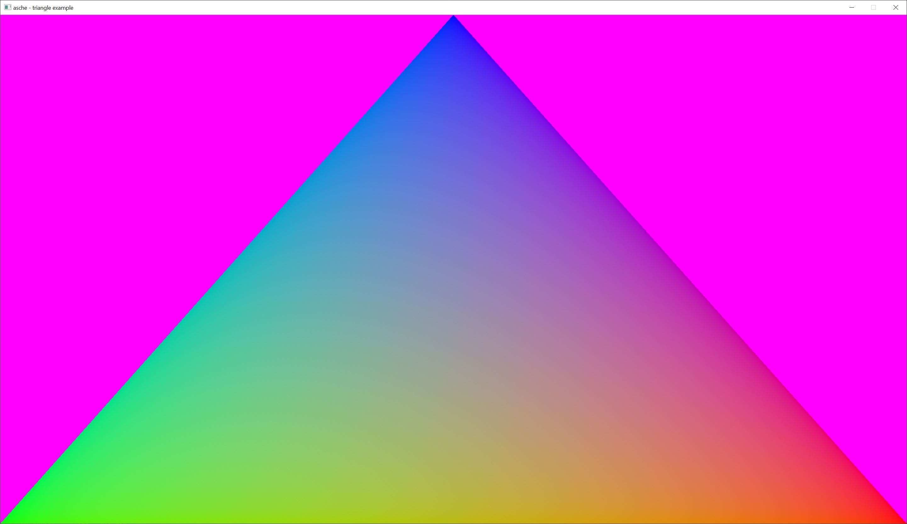
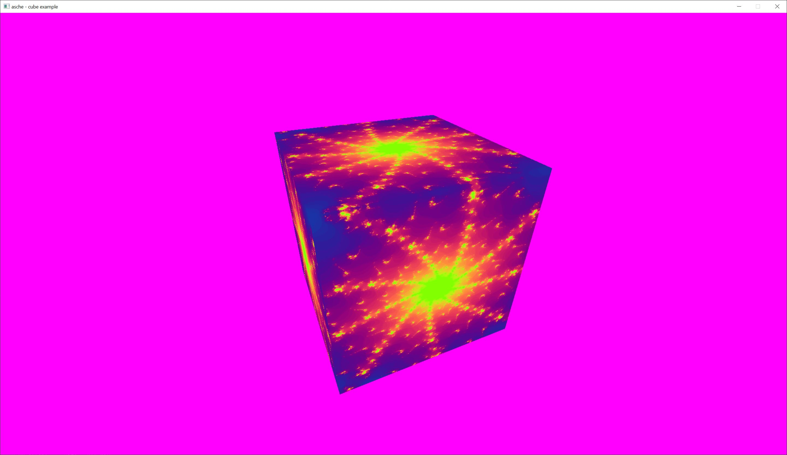
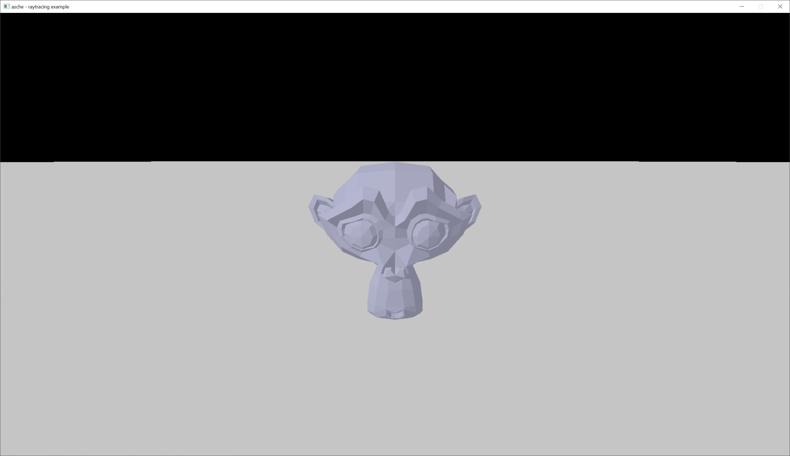

# asche

Provides an abstraction layer above [erupt](https://crates.io/crates/erupt)
to easier use Vulkan in Rust. Mainly handles the Vulkan busywork (device initialization, memory
handling etc.) and the lifetimes of objects.

No validation and a lot of pain.

## Requirements

Vulkan 1.2.

Used features:

- "buffer device address"
- "timeline_semaphores"

## Status

General API is finished. Not stability

## Examples

Examples are provided. They use SDL2 for windowing.

### Triangle

Most simple example that shows how to draw a triangle in Vulkan.

### Cube

Shows how to use push constants, vertex and index buffers and also compressed textures.

### Raytracing

Uses the `VK_raytracing_KHR` extension to fully ray trace a simple scene. Shows how to initialize
and use acceleration structures (triangle based), create and use the shader binding table (SBT), use
descriptor indexing with non uniform indexes and partial binds, write raytracing shader and do very
basic lightning.

### Compute

Simple compute example.

## License

Licensed under MIT or Apache-2.0 or ZLIB.
